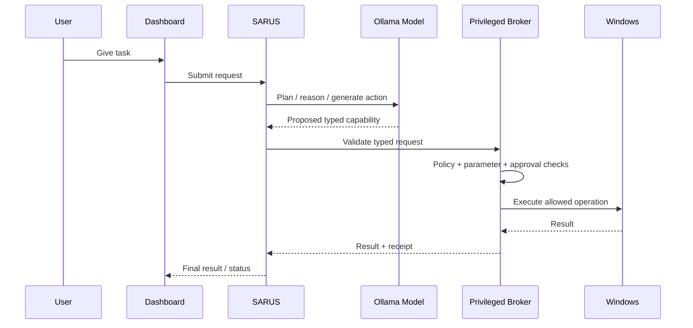
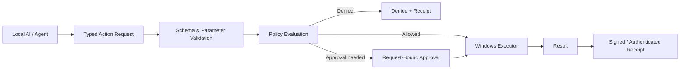
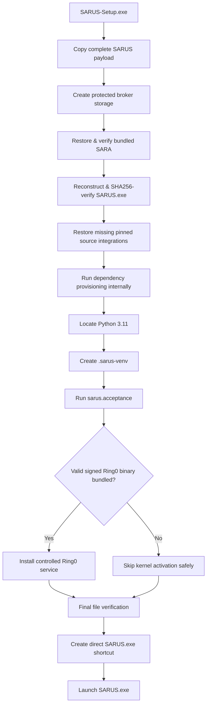
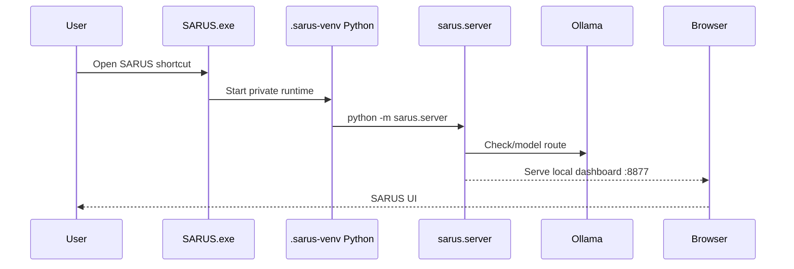

# SARUS

> **SARUS — Local Multi-Agent AI Research & Windows Automation Platform**  
> Developed for **ITCYBER TECHNOLOGIES PVT LTD**  
> Primary platform: **Windows 10/11 x64**  
> Installer generation: **SARUS-Setup.exe v1.2.0**

SARUS is a Windows-first local AI workspace that combines a central orchestration layer, SARA, Ollama model routing, multiple agent/research source integrations, a browser dashboard, an audited privileged Windows broker, and a controlled Windows Ring-0 driver bridge.

The normal testing-laptop installation path is intentionally simple:

```text
Download SARUS-Setup.exe
        ↓
Run as Administrator
        ↓
Installer provisions SARUS automatically
        ↓
Desktop shortcut points directly to SARUS.exe
        ↓
SARUS starts
```

**The end user does not need to manually run `INSTALL-SARUS.bat`, `START_SARUS.bat`, or `INSTALL-RING0.bat` for the normal EXE installation flow.** Some legacy/internal batch files remain in the repository because SARA and developer workflows still use them internally, but the testing-laptop user-facing path is the single EXE.

---

## 1. Quick facts

| Item | Value |
|---|---|
| Product | SARUS |
| Publisher | ITCYBER TECHNOLOGIES PVT LTD |
| Main OS | Windows 10/11 x64 |
| Recommended installer | `SARUS-Setup.exe` |
| Current installer version | 1.2.0 |
| Main dashboard | `http://127.0.0.1:8877` |
| SARA dashboard | `http://127.0.0.1:3000/dashboard/command` |
| Local model runtime | Ollama |
| Main Python runtime | Python 3.11 private venv |
| Privileged Windows layer | SARUS Privileged Broker |
| Ring-0 layer | `SarusRing0.sys` controlled kernel bridge |
| Default network exposure | localhost |
| Main install directory | `C:\Program Files\SARUS` |
| Main install logs | `C:\Program Files\SARUS\logs\` |

---

## 2. What SARUS is

SARUS is not simply one chatbot and it is not only one upstream open-source repository. It is a unified local AI platform around a SARUS orchestration core.

Its main responsibilities are:

- run local AI models through Ollama;
- route tasks to different capabilities and source integrations;
- provide browser-based local control and observability;
- integrate the custom SARA Windows assistant;
- coordinate multiple agent/research source trees;
- expose approved Windows operations through a privileged broker;
- keep high-risk actions typed, logged and auditable;
- optionally communicate with a controlled Windows kernel driver;
- run acceptance checks after installation;
- preserve the system as a reproducible R&D/testing workspace.

---

## 3. Main architecture

```mermaid
flowchart TD
    U[User / Researcher] --> UI[SARUS Local Dashboard]
    UI --> API[SARUS HTTP/API Layer]

    API --> ORCH[Task & Agent Orchestrator]
    ORCH --> MODELS[Ollama Local Model Router]
    ORCH --> SOURCES[Source / Agent Adapters]
    ORCH --> MEMORY[Task, Memory, Events & Receipts]

    ORCH --> PB[Privileged Broker]
    PB --> WIN[Typed Windows Actions]
    PB --> APPROVAL[Approval / Policy Layer]
    PB --> R0[Controlled Ring0 Bridge]

    R0 --> DEV[\\.\SarusRing0]
    DEV --> DRV[SarusRing0.sys]
    DRV --> KERNEL[Windows Kernel]
```

### Architecture principle

The local model does not receive a generic unrestricted Windows kernel handle. Requests flow through SARUS policy and typed capability boundaries.

---

## 4. Runtime request flow

A normal SARUS task follows this pattern:



This design keeps the reasoning layer separated from the privileged executor.

---

## 5. Included source integrations

SARUS brings together the SARUS core and the custom SARA environment with pinned source integrations.

Current source families include:

1. **SARA** — custom Windows local AI assistant and automation environment.
2. **NousResearch / hermes-agent** — agent/tool workflow patterns.
3. **ECC** — additional capability/source integration.
4. **agency-agents** — role-based multi-agent workflow patterns.
5. **awesome-llm-apps** — LLM application examples and adapters.
6. **second-brain-skills** — reusable assistant and knowledge skills.
7. **superpowers** — additional reusable agent patterns.
8. **fable-os** — experimental AI/OS-oriented source integration.
9. **CAI** — security-oriented agent/source material.
10. **autoresearch** — research automation source integration.

Public source versions are pinned in:

```text
config\online_sources.json
```

When a pinned source is already bundled in the installer, SARUS uses the local copy. When a pinned public source is missing, the installer can restore the exact configured commit from GitHub.

---

## 6. Core SARUS components

### 6.1 SARUS server

Main local application entry point:

```text
sarus\server.py
```

Default dashboard URL:

```text
http://127.0.0.1:8877
```

### 6.2 Ollama model router

Model configuration:

```text
config\models.json
```

Configured model groups currently include categories such as:

#### General

```text
qwen2.5:7b
glm4:latest
mistral:latest
llama3:latest
```

#### Coding

```text
qwen2.5-coder:7b
deepseek-coder:latest
```

#### Vision

```text
qwen2.5vl:3b
```

#### Embeddings

```text
nomic-embed-text-v2-moe:latest
```

#### Lightweight / fast

```text
qwen2:1.5b
gemma:2b
```

Cloud-tagged models can remain outside the strict local route.

### 6.3 SARA

SARA provides the custom Windows-oriented assistant/runtime integrated into the larger SARUS workspace.

During installation, the verified bundled SARA source is reconstructed when needed and its dependency setup is executed automatically by the SARUS installer engine.

### 6.4 Privileged Broker

The privileged broker is the boundary between AI reasoning and higher-privilege Windows operations.

Main configuration:

```text
config\broker_allowlist.json
```

Main implementation:

```text
sarus\core\privileged_broker.py
sarus\core\windows.py
```

Typical capabilities include:

- process/service inspection;
- approved workspace file operations;
- allowlisted service actions;
- allowlisted process actions;
- URL opening;
- controlled Ring-0 status/ping operations.

The broker uses default-deny behavior and strict typed parameters.

---

## 7. Privileged action architecture



Important security properties include:

- default deny;
- typed action IDs;
- parameter validation;
- resource allowlists;
- replay-window protection;
- request-bound approval proof support;
- audit receipt generation;
- redaction of sensitive payload values.

---

## 8. Controlled Ring-0 bridge

SARUS contains an actual Windows kernel driver project:

```text
driver\SarusRing0\
```

Important files:

```text
driver\SarusRing0\driver.c
driver\SarusRing0\sarus_ring0_shared.h
driver\SarusRing0\SarusRing0.vcxproj
driver\SarusRing0\BUILD-RING0.ps1
driver\SarusRing0\INSTALL-RING0.ps1
```

Current broker-visible Ring-0 capabilities are:

```text
ring0.ping
ring0.status
```

The call path is:

```mermaid
flowchart TD
    SARUS[SARUS] --> BROKER[Privileged Broker]
    BROKER --> BRIDGE[Ring0Bridge Python Client]
    BRIDGE --> IOCTL[Fixed DeviceIoControl Call]
    IOCTL --> DEVICE[\\.\SarusRing0]
    DEVICE --> DRIVER[SarusRing0.sys]
    DRIVER --> KERNEL[Windows Kernel Mode]
    KERNEL --> DRIVER
    DRIVER --> BRIDGE
    BRIDGE --> SARUS
```

The current driver reports protocol/capability information and kernel-side telemetry such as IRQL/timing status.

### Ring-0 signing status and the one-click installer

The EXE installer contains the complete SARUS application source and Ring-0 driver source project.

A Windows kernel driver cannot be silently treated like a normal unsigned application binary. Therefore installer v1.2.0 behaves as follows:

```text
If a prebuilt SarusRing0.sys exists
    AND its Authenticode status is Valid
        → EXE automatically installs/starts the controlled Ring0 driver
Else
        → SARUS application installation succeeds
        → Ring0 source remains installed
        → kernel driver activation is skipped and logged
```

The installer does **not** disable Secure Boot, Windows driver-signature enforcement, Defender, or Code Integrity.

This means the **full normal SARUS application is one-click installed**, while actual kernel-driver activation still depends on having a driver binary legitimately trusted by the target Windows machine.

---

# 9. Single-EXE installation — recommended method

For the dedicated testing laptop, this is the normal installation method.

## What you need to do

Only these steps are required:

1. Download `SARUS-Setup.exe`.
2. Right-click it and choose **Run as administrator**.
3. Accept the Windows UAC prompt.
4. Keep internet connected during the first setup.
5. Let the installer complete.
6. Use the **SARUS** desktop shortcut.

You do **not** need to manually run any project `.bat` file.

---

## 10. What `SARUS-Setup.exe` does automatically

Installer v1.2.0 performs this chain:



### Automatic steps in detail

The installer:

- installs files into `C:\Program Files\SARUS` by default;
- creates/initializes protected broker storage;
- checks that the SARUS core payload exists;
- reconstructs the bundled SARA source when necessary;
- validates SARA source SHA-256 before extraction;
- reconstructs the small `SARUS.exe` launcher from the verified bundled payload;
- validates the `SARUS.exe` SHA-256 value;
- restores configured pinned source projects if not already present;
- executes SARA dependency provisioning internally;
- checks for Python 3.11;
- creates a private `.sarus-venv` Python environment;
- runs `python -m sarus.acceptance`;
- detects a trusted prebuilt Ring-0 driver when one is bundled;
- automatically installs that driver only when its signature status is valid;
- verifies important final files;
- creates Start Menu/Desktop shortcuts directly to `SARUS.exe`;
- launches SARUS automatically.

---

## 11. Internal scripts vs manual user steps

The repository still contains files such as:

```text
INSTALL-SARUS.bat
START_SARUS.bat
INSTALL-RING0.bat
```

These are retained for repository development, debugging and backwards compatibility.

### Normal testing-laptop rule

```text
DO:     SARUS-Setup.exe
DO NOT: manually run setup BAT files unless debugging the repository
```

The EXE may internally invoke a legacy SARA batch dependency installer through `cmd.exe`. That is an implementation detail of the installer and requires no action from the user.

---

## 12. Installation directory

Default:

```text
C:\Program Files\SARUS
```

Important installed paths:

```text
C:\Program Files\SARUS\SARUS.exe
C:\Program Files\SARUS\.sarus-venv\
C:\Program Files\SARUS\sarus\
C:\Program Files\SARUS\config\
C:\Program Files\SARUS\sources\
C:\Program Files\SARUS\driver\SarusRing0\
C:\Program Files\SARUS\installer\
C:\Program Files\SARUS\logs\
C:\Program Files\SARUS\README.md
```

---

## 13. System requirements

### Required

- Windows 10 or Windows 11 x64;
- Administrator permission;
- Windows PowerShell 5.1;
- internet access for missing source/dependency/model downloads;
- enough free storage for source trees and AI models.

### Recommended

- 25 GB or more free disk space for comfortable experimentation;
- 16 GB RAM or more for local AI workloads;
- SSD/NVMe storage;
- dedicated testing machine for privileged/R&D experiments;
- stable internet during first installation.

### Components used by the environment

Depending on the existing machine state, SARA/SARUS may use or provision:

- Python 3.11 x64;
- Python Launcher (`py.exe`);
- Git for Windows;
- Node.js/npm;
- Ollama;
- browser/web runtime dependencies;
- Windows `tar.exe`.

The EXE installer owns the setup flow; you normally do not need to install these manually before trying the official installer.

---

## 14. First launch

When installation succeeds, SARUS is launched through:

```text
C:\Program Files\SARUS\SARUS.exe
```

The main local dashboard is:

```text
http://127.0.0.1:8877
```

SARA's dashboard, when its web component is running, is normally:

```text
http://127.0.0.1:3000/dashboard/command
```

If a browser opens before the local server is fully ready, refresh the page after SARUS finishes startup.

---

## 15. Startup diagram



---

## 16. Verify the installation

### Basic file checks

Open PowerShell as Administrator:

```powershell
cd "C:\Program Files\SARUS"
Test-Path .\SARUS.exe
Test-Path .\.sarus-venv\Scripts\python.exe
Test-Path .\sarus\server.py
Test-Path .\config\models.json
Test-Path .\config\broker_allowlist.json
```

All should return:

```text
True
```

### Run acceptance checks

```powershell
cd "C:\Program Files\SARUS"
.\.sarus-venv\Scripts\python.exe -m sarus.acceptance
```

### Test local dashboard

```powershell
Invoke-WebRequest http://127.0.0.1:8877
```

### Check Ollama

```powershell
ollama list
```

or:

```powershell
Invoke-WebRequest http://127.0.0.1:11434/api/tags
```

---

## 17. Ring-0 status verification

After the normal EXE install, you can inspect the controlled Ring-0 bridge from the private runtime:

```powershell
cd "C:\Program Files\SARUS"
.\.sarus-venv\Scripts\python.exe -c "from sarus.core.ring0 import Ring0Bridge; import json; print(json.dumps(Ring0Bridge().status(), indent=2))"
```

Possible states:

### Driver active

```text
"ok": true
"driver_present": true
"protocol_version": 1
```

### Source installed but no trusted driver loaded

The status will report that the device/driver is unavailable. The rest of SARUS can still run.

---

## 18. Important logs

### Single-EXE bootstrap log

```text
C:\Program Files\SARUS\logs\exe-install.log
```

### Main installation engine log

```text
C:\Program Files\SARUS\logs\github-install.log
```

If installation fails, these two files should be checked first.

The EXE installer now treats a non-zero installation-engine exit code as a setup failure and shows the path of the log instead of silently pretending the installation succeeded.

---

## 19. Common installation problems

### `Python 3.11 was not found`

The dependency provisioning stage did not leave Python 3.11 available through the Windows Python Launcher.

Check:

```powershell
py -0p
py -3.11 --version
```

Then retry `SARUS-Setup.exe` after correcting Python installation.

### npm command fails inside SARA setup

Check:

```powershell
node --version
npm --version
where.exe node
where.exe npm
```

If Node/npm is broken, repair the Node installation and rerun the EXE installer.

### Ollama port `11434` is already in use

This usually means Ollama is already running.

Check:

```powershell
Get-NetTCPConnection -LocalPort 11434 -ErrorAction SilentlyContinue
```

Do not start a second Ollama server if one is already listening.

### `SARUS.exe` checksum mismatch

The installer reconstructs `SARUS.exe` and verifies it against:

```text
vendor\launcher\SHA256.txt
```

If that verification fails, the installer intentionally stops.

### Source download fails

The official installer carries the verified SARA bundle, but missing public pinned projects can require internet access.

Confirm:

- internet is connected;
- GitHub/codeload is reachable;
- firewall/proxy is not blocking the request.

### Ring-0 driver is not active

This does not mean the entire SARUS install failed.

Check whether a binary exists:

```powershell
Test-Path "C:\Program Files\SARUS\driver\SarusRing0\bin\Release\SarusRing0.sys"
```

If present, inspect its signature:

```powershell
Get-AuthenticodeSignature "C:\Program Files\SARUS\driver\SarusRing0\bin\Release\SarusRing0.sys"
```

The single-EXE bootstrap automatically activates the driver only when Windows reports the signature as `Valid`.

---

## 20. Folder map

```text
SARUS\
├── SARUS.exe                         # Direct Windows launcher created during install
├── README.md
├── sarus\                            # SARUS Python core
│   ├── server.py
│   ├── acceptance.py
│   └── core\
│       ├── privileged_broker.py
│       ├── windows.py
│       ├── ring0.py
│       └── receipts.py
├── config\
│   ├── models.json
│   ├── online_sources.json
│   ├── broker_allowlist.json
│   └── policy.json
├── sources\                          # SARA + integrated/pinned source projects
├── driver\
│   └── SarusRing0\
│       ├── driver.c
│       ├── sarus_ring0_shared.h
│       ├── SarusRing0.vcxproj
│       ├── BUILD-RING0.ps1
│       └── INSTALL-RING0.ps1
├── installer\
│   ├── SARUS-Setup.iss
│   ├── EXE-INSTALL.ps1
│   ├── INSTALL-SARUS.ps1
│   ├── SETUP-BROKER.ps1
│   └── UNINSTALL-SARUS.ps1
├── vendor\
│   ├── launcher\
│   │   ├── SARUS.exe.b64
│   │   └── SHA256.txt
│   └── sara\
│       └── finalparts\
├── logs\                             # Created at install/runtime
└── .sarus-venv\                      # Created automatically by installer
```

---

## 21. Installer v1.2.0 changes

This release changes the Windows installation experience substantially.

### Changed

- Start Menu shortcut points directly to `SARUS.exe`.
- Desktop shortcut points directly to `SARUS.exe`.
- Normal install no longer tells the user to launch `START_SARUS.bat`.
- `EXE-INSTALL.ps1` is fully non-interactive.
- The installation engine now supports `-NonInteractive` and `-NoLaunch` modes for the EXE bootstrap.
- The launcher is mandatory and SHA-256 verified.
- The private SARUS Python environment is recreated/verified during install.
- Acceptance tests run before the installer declares success.
- Final required files are verified before launch.
- A validly signed prebuilt `SarusRing0.sys`, when bundled, is automatically activated.
- An unsigned/untrusted Ring-0 binary is skipped rather than weakening Windows security.
- The installer engine's exit code is propagated to the Inno Setup UI.
- CI validates PowerShell syntax and checks that user-facing shortcuts do not point to `START_SARUS.bat`.
- The Windows build artifact includes the new README alongside the installer and SHA-256 file.

---

## 22. Build the installer from source

The Inno Setup definition is:

```text
installer\SARUS-Setup.iss
```

GitHub Actions workflow:

```text
.github\workflows\build-windows-installer.yml
```

Workflow name:

```text
Build SARUS Windows Installer
```

The workflow:

1. checks out SARUS;
2. validates the one-click installer payload;
3. parses PowerShell installer scripts for syntax errors;
4. checks that shortcuts use `SARUS.exe`;
5. compiles Python source;
6. locates/installs Inno Setup;
7. builds `SARUS-Setup.exe`;
8. verifies that the EXE was actually produced;
9. calculates SHA-256;
10. uploads the Windows installer artifact.

Artifact name:

```text
SARUS-Windows-Installer
```

Artifact contents:

```text
SARUS-Setup.exe
SHA256.txt
README.md
```

---

## 23. Verify downloaded installer SHA-256

After downloading the CI artifact:

```powershell
Get-FileHash .\SARUS-Setup.exe -Algorithm SHA256
Get-Content .\SHA256.txt
```

The hashes should match.

---

## 24. SmartScreen / code-signing note

The GitHub-built application installer can show **Unknown publisher** when no Windows application code-signing certificate is configured in CI.

That is different from the kernel-driver signing requirement.

For production distribution, two signing concerns exist:

1. **Application installer signing** — sign `SARUS-Setup.exe`.
2. **Kernel driver signing** — provide a Windows-trusted signature for `SarusRing0.sys` using an appropriate Microsoft/Windows driver-signing process.

Do not solve either issue by disabling Windows security enforcement.

---

## 25. Uninstall

Use normal Windows installed-app removal:

```text
Settings
→ Apps
→ Installed apps
→ SARUS
→ Uninstall
```

The Inno uninstaller automatically invokes:

```text
installer\UNINSTALL-SARUS.ps1
```

The cleanup logic removes the SARUS shortcut and controlled Ring-0 service/driver file when present.

By default, user state under local application-data locations may be preserved depending on the cleanup mode so research state is not destroyed accidentally.

---

## 26. Updating SARUS

For the testing laptop, the cleanest upgrade path is:

```text
Build new SARUS-Setup.exe
        ↓
Verify SHA-256
        ↓
Run new installer as Administrator
        ↓
Installer reuses the SARUS application directory
        ↓
Runtime and source checks run again
```

The installer uses the same application ID so a newer build upgrades the existing SARUS installation rather than creating a completely unrelated application entry.

---

## 27. R&D / testing-laptop recommendations

For privileged Windows and kernel research, use SARUS on an intentionally prepared testing machine.

Recommended lab controls:

- maintain a restorable system image;
- keep project/research data backed up outside the OS disk;
- use dedicated test credentials rather than personal accounts;
- keep the machine on an authorized test network;
- record experiment IDs and results;
- preserve crash dumps for failed kernel experiments;
- version driver builds;
- keep a known-good driver build available for rollback;
- retain installer and runtime logs;
- avoid mixing uncontrolled production workloads with kernel-driver experiments.

---

## 28. Security boundaries

Current SARUS privileged design intentionally keeps several operations outside the generic broker surface.

The broker does not provide a caller-controlled arbitrary shell or a generic raw kernel interface.

Examples of intentionally blocked generic primitives include:

```text
arbitrary_exec
driver.raw_ioctl
kernel.read_memory
kernel.write_memory
kernel.map_physical_memory
security.disable_controls
audit.disable
```

The controlled Ring-0 bridge uses fixed explicit capabilities compiled into the driver/client protocol.

---

## 29. Installation troubleshooting checklist

If `SARUS-Setup.exe` fails:

1. Confirm you accepted the UAC Administrator prompt.
2. Confirm Windows is x64.
3. Keep internet connected.
4. Confirm enough free disk space.
5. Open:
   `C:\Program Files\SARUS\logs\exe-install.log`
6. Open:
   `C:\Program Files\SARUS\logs\github-install.log`
7. Check `py -3.11 --version`.
8. Check `node --version` and `npm --version` if SARA dependency setup failed.
9. Check `ollama --version` if model runtime setup failed.
10. Re-run the same official `SARUS-Setup.exe` after fixing the identified dependency.

---

## 30. Testing-laptop success checklist

A normal successful installation should leave:

```text
[✓] C:\Program Files\SARUS\SARUS.exe
[✓] C:\Program Files\SARUS\.sarus-venv\Scripts\python.exe
[✓] C:\Program Files\SARUS\sarus\server.py
[✓] C:\Program Files\SARUS\config\models.json
[✓] C:\Program Files\SARUS\config\broker_allowlist.json
[✓] Desktop SARUS shortcut → SARUS.exe
[✓] SARUS acceptance checks passed
[✓] Main dashboard available on 127.0.0.1:8877 after startup
```

Ring-0 is a separate status item:

```text
[✓] Ring0 source installed with SARUS
[✓/optional] Trusted SarusRing0.sys present
[✓/optional] SarusRing0 service running
```

---

# Final installation summary

For a normal dedicated SARUS testing laptop, the intended workflow is now:

```text
1. Get SARUS-Setup.exe
2. Run as Administrator
3. Let it finish
4. Open SARUS desktop shortcut
5. Use http://127.0.0.1:8877
```

**No manual project BAT-file installation step is required in the normal v1.2.0 EXE flow.**
