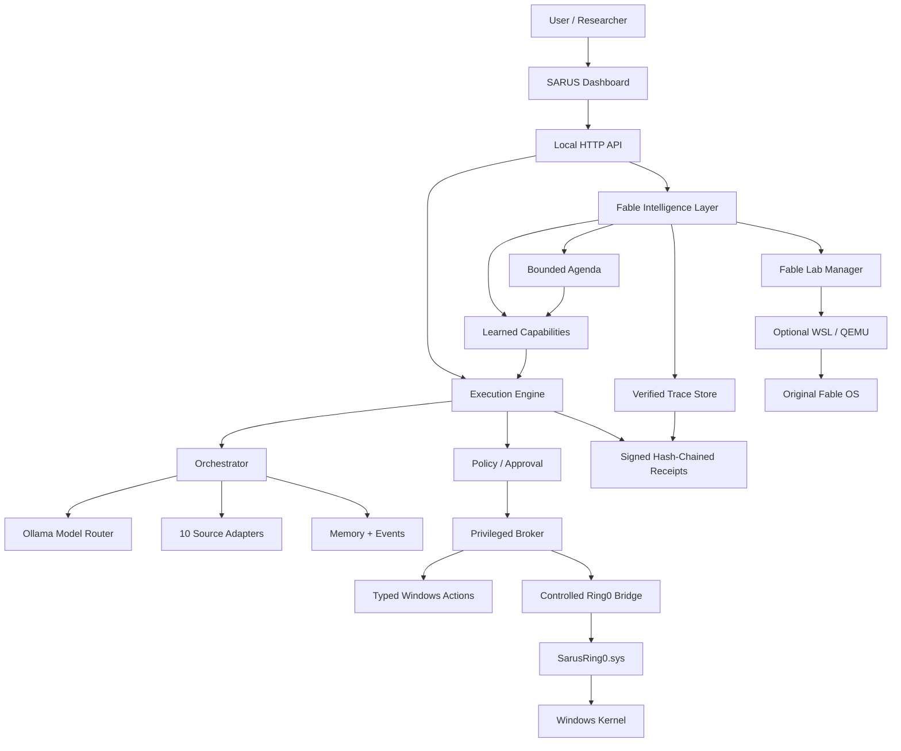
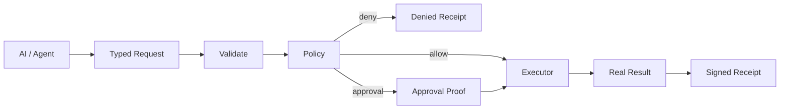
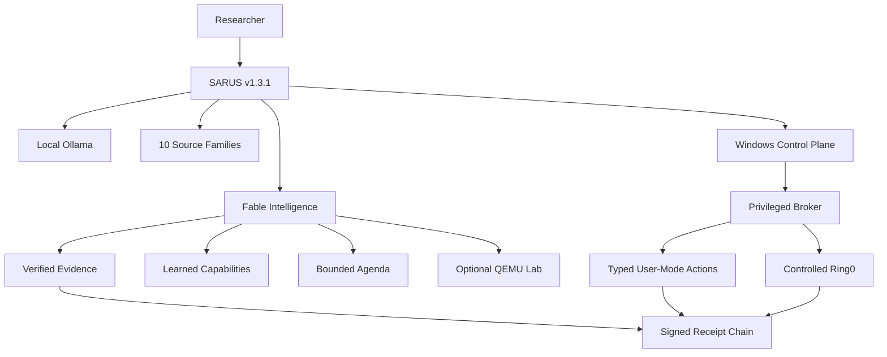

# SARUS

> **SARUS — Local Multi-Agent AI Research & Windows Automation Platform**  
> Developed for **ITCYBER TECHNOLOGIES PVT LTD**  
> Primary platform: **Windows 10/11 x64**  
> Current stabilization release: **SARUS v1.3.1**

SARUS is a Windows-first local AI research and automation platform that combines local Ollama models, SARA, ten pinned research/source families, multi-agent orchestration, local memory, signed execution receipts, a typed privileged Windows broker, a controlled Ring-0 bridge, and the Fable Intelligence Layer.

Version **1.3.1** is the production-stabilization release after the Fable v1.3 integration. It removes stale transfer automation, makes installation acceptance manifest-driven, explicitly provisions required local Ollama models during the official EXE installation, adds target-machine certification reports, adds release-signing helpers, and makes production/security/installer checks first-class CI gates.

---

## 1. One-click Windows installation

The normal testing-laptop installation path is a single EXE:

```text
SARUS-Setup.exe
      ↓
Run as Administrator
      ↓
Copy verified SARUS payload
      ↓
Provision protected broker keys
      ↓
Restore SARA + pinned source integrations
      ↓
Create private Python 3.11 environment
      ↓
Start/check local Ollama
      ↓
Pull missing required local models
      ↓
Run SARUS production acceptance
      ↓
Activate controlled Ring0 only when a valid signed driver is bundled
      ↓
Run target-machine certification
      ↓
Create direct SARUS.exe shortcut
      ↓
Launch SARUS
```

The normal user does **not** need to manually run `INSTALL-SARUS.bat`, `START_SARUS.bat`, or `INSTALL-RING0.bat`.

Default installation path:

```text
C:\Program Files\SARUS
```

Main dashboard:

```text
http://127.0.0.1:8877
```

Fable Lab:

```text
http://127.0.0.1:8877/fable.html
```

SARA dashboard when its web runtime is active:

```text
http://127.0.0.1:3000/dashboard/command
```

---

## 2. Quick facts

| Item | Value |
|---|---|
| Product | SARUS |
| Version | 1.3.1 |
| Publisher | ITCYBER TECHNOLOGIES PVT LTD |
| Primary OS | Windows 10/11 x64 |
| End-user installer | `SARUS-Setup.exe` |
| Main runtime | Python 3.11 private `.sarus-venv` |
| Model runtime | Local Ollama |
| Source families | 10 |
| Reproducible indexed source files | 17,129 |
| Privileged execution | Typed Privileged Broker |
| Kernel layer | Controlled `SarusRing0.sys` bridge |
| Fable integration | Native Fable Intelligence Layer + optional isolated QEMU lab |
| Main network exposure | localhost |
| Build manifest | `BUILD_MANIFEST.json` |
| Production profile | `config/production.json` |

---

## 3. Architecture



The central rule is:

```text
AI reasoning != privileged execution
```

A model may propose work, but high-impact machine actions pass through typed policy/broker controls and produce execution receipts.

---

## 4. Included source families

SARUS coordinates:

1. **SARA** — Windows local assistant/runtime.
2. **NousResearch / hermes-agent** — agent/tool workflow concepts.
3. **ECC** — skills, agents, commands and verification patterns.
4. **agency-agents** — specialist persona/role patterns.
5. **awesome-llm-apps** — application/workflow patterns.
6. **second-brain-skills** — reusable knowledge/assistant skills.
7. **superpowers** — reusable development/agent methods.
8. **fable-os** — AI-native OS research source and Fable Intelligence Layer.
9. **CAI** — security-oriented research material, isolated according to SARUS policy.
10. **autoresearch** — bounded research/experiment material.

Paths are configured in:

```text
config\sources.json
```

Public source pins are configured in:

```text
config\online_sources.json
```

The current Fable source pin is:

```text
robiot/fable-os
1cfe17c4baa77fac128008621721823913a1335c
```

---

## 5. Local Ollama layer

Model routing is defined in:

```text
config\models.json
```

The production-required model subset is defined in:

```text
config\production.json
```

Required v1.3.1 models:

```text
qwen2.5:7b
qwen2.5-coder:7b
qwen2.5vl:3b
nomic-embed-text-v2-moe:latest
```

During the official EXE installation, SARUS verifies the local Ollama API and automatically downloads required models that are missing. Installation fails with a clear acceptance error instead of silently completing without a required model.

Additional configured local models may be used when already available, but they are not all required for the production baseline.

Cloud-tagged models in `cloud_disabled` are not part of the required local production baseline.

---

## 6. Production acceptance

Main acceptance module:

```text
sarus\acceptance.py
```

Version 1.3.1 no longer uses the historical hard-coded `17,356` count. It reads the current reproducible expectation from `BUILD_MANIFEST.json`.

Core acceptance covers:

- version synchronization;
- ten source adapters;
- capability registry vs manifest;
- signed receipt chain;
- memory write/search;
- policy approval gate;
- CAI isolation;
- Fable native integration;
- Fable source completeness;
- model-prose vs proof boundary;
- local Ollama availability;
- required local models;
- Windows process broker on Windows;
- SARA native bridge on Windows;
- optional native ECC/Hermes status;
- optional controlled Ring0 status unless explicitly required.

Developer/manual full check:

```powershell
.\.sarus-venv\Scripts\python.exe -m sarus.acceptance --full
```

Require the controlled Ring0 driver as part of the acceptance gate:

```powershell
.\.sarus-venv\Scripts\python.exe -m sarus.acceptance --full --require-ring0
```

---

## 7. Target-machine certification

Script:

```text
installer\CERTIFY-SARUS.ps1
```

Report:

```text
C:\Program Files\SARUS\logs\production-certification.json
```

The report records:

- core acceptance result;
- required-file completeness;
- application Authenticode status;
- controlled Ring0 runtime status;
- bundled Ring0 driver signature status;
- Doctor/model/Fable diagnostics.

Normal internal certification:

```powershell
& "C:\Program Files\SARUS\installer\CERTIFY-SARUS.ps1"
```

Strict application-signature certification:

```powershell
& "C:\Program Files\SARUS\installer\CERTIFY-SARUS.ps1" -RequireSignedApp
```

Strict controlled Ring0 certification:

```powershell
& "C:\Program Files\SARUS\installer\CERTIFY-SARUS.ps1" -RequireRing0
```

A GitHub CI pass is not a substitute for this physical-laptop report because audio/camera/GPU/drivers/WSL and local runtime state are machine-specific.

---

## 8. Privileged Broker

Core files:

```text
sarus\core\privileged_broker.py
sarus\core\windows.py
config\broker_allowlist.json
```

Properties include:

- default deny;
- typed action IDs;
- parameter/schema validation;
- resource mappings and path scopes;
- request-bound approval proof;
- replay protection;
- signed receipts;
- sensitive-value redaction.

Typical flow:



There is no generic model-facing PowerShell/cmd executor in the privileged broker.

---

## 9. Controlled Ring0 bridge

Driver project:

```text
driver\SarusRing0\
```

User-mode bridge:

```text
sarus\core\ring0.py
```

Current fixed capabilities:

```text
ring0.ping
ring0.status
```

Architecture:

```mermaid
flowchart LR
    SARUS --> BROKER[Privileged Broker]
    BROKER --> BRIDGE[Ring0Bridge]
    BRIDGE --> DEVICE[\\.\SarusRing0]
    DEVICE --> DRIVER[SarusRing0.sys]
    DRIVER --> KERNEL[Windows Kernel]
```

The bridge intentionally has no public generic raw IOCTL method and no caller-selected arbitrary kernel-memory address API.

### Driver activation

The EXE installer activates a bundled driver only when Windows reports a valid Authenticode signature for that binary. Otherwise SARUS installs normally and records that kernel-driver activation was skipped.

The installer does not disable Secure Boot, Code Integrity, Defender, HVCI, or driver-signature enforcement.

---

## 10. Fable Intelligence Layer

Implementation:

```text
sarus\core\fable.py
sarus\adapters\fable_os.py
sarus\web\fable.html
docs\FABLE-INTEGRATION.md
```

Native Fable functionality includes:

### Verified execution traces

```text
model prose != execution proof
```

Trusted SARUS events can be linked to signed receipts. Imported bracket-looking text remains an unverified candidate/prose unless SARUS itself produced verified evidence.

### Learned capabilities

Reusable task definitions are versioned and hashed. Execution returns through the normal SARUS execution/policy path.

### Bounded agenda

Supported scheduling modes:

```text
boot
once
every
```

Agenda execution is bounded by item count, minimum period, maximum runs, consecutive failure cutoff and one action per scheduler tick.

### Original Fable QEMU lab

The original Fable x86_64 OS remains an optional isolated research target. On Windows, its build/run path can use WSL and QEMU when those prerequisites exist.

Missing WSL/QEMU does not make the normal Windows SARUS host fail production acceptance.

Detailed Fable documentation:

```text
docs\FABLE-INTEGRATION.md
```

---

## 11. Release signing

Application signing helper:

```text
installer\SIGN-RELEASE.ps1
```

The script expects an organization code-signing certificate already installed/available to SignTool. It uses SHA-256 file digests and RFC3161 timestamping and verifies the resulting Authenticode signature.

Example developer release operation:

```powershell
.\installer\SIGN-RELEASE.ps1 -CertificateThumbprint "<COMPANY_CERT_THUMBPRINT>"
```

No private certificate/private key is stored in this repository.

### Kernel driver signing

`SarusRing0.sys` public distribution is a separate Windows driver-signing process. A locally compiled `.sys` is not automatically considered a production-signed public kernel driver.

See:

```text
docs\PRODUCTION-READINESS.md
```

---

## 12. CI gates

Active release workflows:

```text
.github\workflows\production-readiness.yml
.github\workflows\fable-integration.yml
.github\workflows\privileged-broker-security.yml
.github\workflows\build-windows-installer.yml
```

They verify combinations of:

- Python compilation;
- production static invariants;
- Fable integration;
- all-source regression;
- Broker security;
- Ring0 fixed-surface policy;
- PowerShell syntax;
- production payload completeness;
- synchronized v1.3.1 metadata;
- Inno Setup EXE compilation;
- final SHA-256 artifact generation.

The active release workflows use read-only repository permissions.

Obsolete one-time source-transfer workflows and marker files are not part of the v1.3.1 release tree.

---

## 13. Installed directory structure

Typical installation:

```text
C:\Program Files\SARUS\
├── SARUS.exe
├── README.md
├── BUILD_MANIFEST.json
├── .sarus-venv\
├── config\
│   ├── models.json
│   ├── production.json
│   ├── sources.json
│   ├── online_sources.json
│   └── broker_allowlist.json
├── sarus\
│   ├── server.py
│   ├── acceptance.py
│   ├── core\
│   ├── adapters\
│   └── web\
├── sources\
├── driver\SarusRing0\
├── installer\
│   ├── CERTIFY-SARUS.ps1
│   ├── SIGN-RELEASE.ps1
│   └── ...
├── docs\
├── tests\
└── logs\
```

---

## 14. Logs

Installation logs:

```text
C:\Program Files\SARUS\logs\exe-install.log
C:\Program Files\SARUS\logs\github-install.log
```

Production certification:

```text
C:\Program Files\SARUS\logs\production-certification.json
```

Fable Lab:

```text
C:\Program Files\SARUS\logs\fable-lab.log
```

---

## 15. Troubleshooting

### Installer stops at model provisioning

Check that Ollama is installed and that the local API can start. SARUS deliberately fails the production install rather than claiming success with missing required models.

### Dashboard does not open

Check:

```text
http://127.0.0.1:8877
```

and inspect `logs\exe-install.log` / `logs\github-install.log`.

### Fable says runtime not ready

The native Fable Intelligence Layer may still be healthy. `runtime_ready=false` refers to the optional original Fable WSL/QEMU research lab.

### Ring0 says driver missing

Normal SARUS can run without the driver. For Ring0-required research, provide a validly signed controlled `SarusRing0.sys`, install it using the provided driver workflow, then run strict certification with `-RequireRing0`.

### Public release signature is missing

An unsigned internal CI artifact can be tested, but `public_release_ready` will remain false until the company signing process is completed.

---

## 16. Production status terminology

SARUS deliberately uses separate status levels:

**CI release-candidate ready** — source, security, integration and installer build gates passed.

**Windows target certified** — the generated EXE was clean-installed on the actual Windows target and `production-certification.json` reports core readiness.

**Public release signed** — application artifacts have valid organization Authenticode signatures and any distributed kernel driver has completed the required Windows/Microsoft signing path.

These statuses are not collapsed into one claim because hardware/certificate evidence cannot be manufactured by CI.

---

## 17. Further documentation

```text
docs\FABLE-INTEGRATION.md
docs\PRODUCTION-READINESS.md
```

---

## Final operating model



**Normal installation remains one `SARUS-Setup.exe`. v1.3.1 adds explicit local-model provisioning, manifest-driven acceptance, target-machine certification, production CI gates and release-signing readiness without weakening Windows security controls.**
