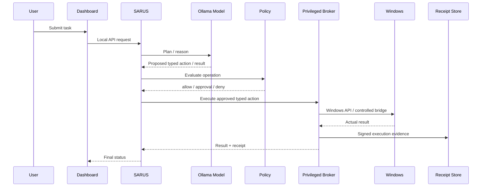
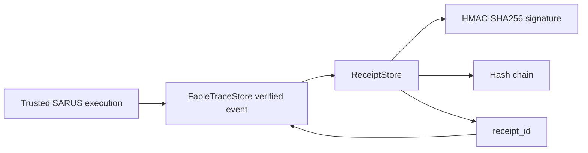
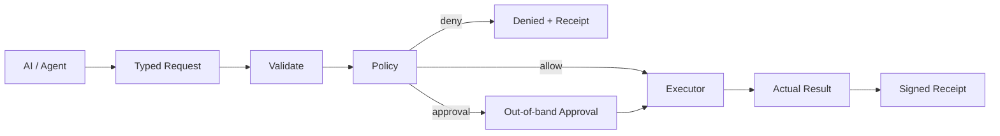
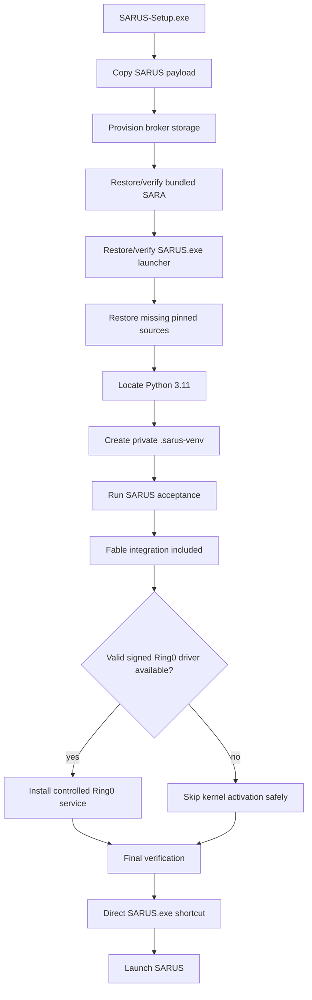
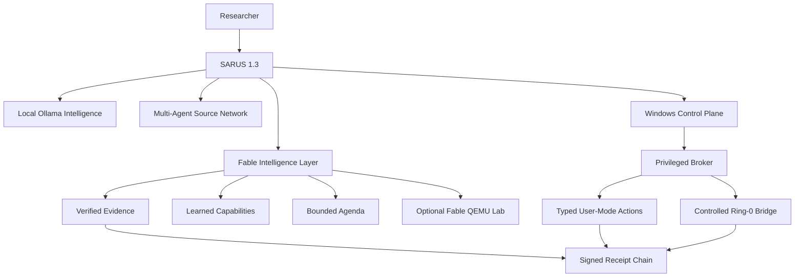

# SARUS

> **SARUS — Local Multi-Agent AI Research & Windows Automation Platform**  
> Developed for **ITCYBER TECHNOLOGIES PVT LTD**  
> Primary platform: **Windows 10/11 x64**  
> Current installer generation: **SARUS-Setup.exe v1.3.0**

SARUS is a Windows-first local AI research and automation workspace that combines local Ollama models, a central task/orchestration layer, SARA, multiple pinned agent/research source trees, persistent memory, signed execution receipts, a typed privileged Windows broker, a controlled Windows Ring-0 bridge, and the **Fable Intelligence Layer**.

Version 1.3 adds a deep integration of the pinned `robiot/fable-os` research source without replacing the Windows host kernel. The original Fable OS remains an isolated QEMU research target, while its strongest architecture ideas are reimplemented as native SARUS services: verified execution traces, versioned learned capabilities, bounded agenda/autonomy, and a managed Fable Lab.

---

## 1. One-click installation

The normal testing-laptop path is intentionally a **single EXE**:

```text
Download SARUS-Setup.exe
        ↓
Right-click → Run as administrator
        ↓
Installer copies and provisions the complete SARUS payload
        ↓
Private Python environment + integrations + acceptance checks
        ↓
Desktop / Start Menu shortcut points directly to SARUS.exe
        ↓
SARUS starts
```

For the normal install flow you do **not** need to manually run:

```text
INSTALL-SARUS.bat
START_SARUS.bat
INSTALL-RING0.bat
```

Those files remain for repository development, recovery, or specialized driver workflows.

Default installation directory:

```text
C:\Program Files\SARUS
```

Main dashboard:

```text
http://127.0.0.1:8877
```

Fable Lab dashboard:

```text
http://127.0.0.1:8877/fable.html
```

SARA dashboard when its web component is active:

```text
http://127.0.0.1:3000/dashboard/command
```

---

## 2. Quick facts

| Item | Current value |
|---|---|
| Product | SARUS |
| Publisher | ITCYBER TECHNOLOGIES PVT LTD |
| Version | 1.3.0 |
| Main platform | Windows 10/11 x64 |
| Installer | `SARUS-Setup.exe` |
| Main dashboard | `127.0.0.1:8877` |
| Fable dashboard | `127.0.0.1:8877/fable.html` |
| SARA dashboard | `127.0.0.1:3000/dashboard/command` |
| Local model runtime | Ollama |
| Python runtime | Python 3.11 private `.sarus-venv` |
| Source families | 10 |
| Clean tracked source files | 17,129 |
| Windows privileged layer | SARUS Privileged Broker |
| Kernel bridge | `SarusRing0.sys` controlled Ring-0 bridge |
| Fable source | `robiot/fable-os` |
| Fable pin | `1cfe17c4baa77fac128008621721823913a1335c` |
| Default network exposure | localhost |

The reproducible clean-checkout source count and version metadata live in `BUILD_MANIFEST.json`.

---

# 3. What SARUS is

SARUS is not one chatbot and it is not one upstream repository. It is a unified local operating/research platform with several cooperating layers.

Its main responsibilities are to:

- run local AI through Ollama;
- route work between specialized source adapters;
- coordinate multi-step research and automation tasks;
- integrate SARA for Windows-oriented assistant functions;
- maintain local memory and event history;
- issue signed/hash-chained execution receipts;
- mediate privileged Windows actions through typed policy controls;
- communicate with a controlled Windows kernel driver when available;
- manage persistent learned capabilities;
- run bounded autonomous agenda items;
- host the Fable Intelligence Layer and isolated Fable OS research lab;
- package the complete environment into a one-click Windows installer;
- run cross-platform CI and Windows installer validation.

---

# 4. Main architecture

```mermaid
flowchart TD
    U[User / Researcher] --> UI[SARUS Dashboard]
    UI --> API[SARUS Local HTTP API]

    API --> EXEC[Execution Engine]
    EXEC --> ORCH[Task / Agent Orchestrator]
    ORCH --> MODELS[Ollama Model Router]
    ORCH --> ADAPTERS[10 Source Adapters]
    ORCH --> MEMORY[Memory + Event Bus]

    EXEC --> POLICY[Policy / Approval Layer]
    POLICY --> PB[Privileged Broker]
    PB --> WIN[Typed Windows Actions]
    PB --> R0[Controlled Ring-0 Bridge]
    R0 --> DEVICE[\\.\SarusRing0]
    DEVICE --> DRIVER[SarusRing0.sys]
    DRIVER --> KERNEL[Windows Kernel]

    EXEC --> RECEIPTS[Signed Hash-Chained Receipts]

    API --> FABLE[Fable Intelligence Layer]
    FABLE --> FTRACE[Verified Fable Trace Store]
    FTRACE --> RECEIPTS
    FABLE --> FCAP[Learned Capability Store]
    FCAP --> EXEC
    FABLE --> AGENDA[Bounded Agenda Engine]
    AGENDA --> FCAP
    FABLE --> LAB[Fable Lab Manager]
    LAB --> FSRC[Pinned Fable Source]
    LAB --> WSL[WSL / Linux Build Environment]
    WSL --> QEMU[QEMU]
    QEMU --> FOS[Fable OS Kernel]
```

The key architectural rule is that the AI reasoning layer and the privileged execution layer remain separate.

---

# 5. Normal task flow



A model statement is not automatically considered proof that an action occurred. Privileged actions are grounded in execution results and receipts.

---

# 6. Included source families

SARUS currently coordinates these source families:

1. **SARA** — custom Windows local AI assistant/runtime.
2. **NousResearch / hermes-agent** — agent/tool workflow concepts.
3. **ECC** — additional capability/source integration.
4. **agency-agents** — role-based multi-agent patterns.
5. **awesome-llm-apps** — LLM application patterns/examples.
6. **second-brain-skills** — knowledge and reusable assistant skills.
7. **superpowers** — reusable agent/development patterns.
8. **fable-os** — AI-native OS research source + native SARUS Fable integration.
9. **CAI** — security-oriented agent/source material.
10. **autoresearch** — automated research workflow material.

Configured paths:

```text
config\sources.json
```

Public repository pins:

```text
config\online_sources.json
```

The Fable pin is intentionally tested independently by CI.

---

# 7. Fable Intelligence Layer

Version 1.3 upgrades Fable from a source/reference adapter into a real SARUS subsystem.

Implementation:

```text
sarus\core\fable.py
sarus\adapters\fable_os.py
sarus\web\fable.html
docs\FABLE-INTEGRATION.md
tests\fable_integration_test.py
.github\workflows\fable-integration.yml
```

The integration has four major native layers.

## 7.1 Verified execution traces

Fable's useful trust principle is retained:

```text
model explanation != machine proof
```

SARUS native flow:



Trace kinds:

- `verified` — created by trusted SARUS execution and linked to a signed receipt;
- `kernel_candidate` — imported Fable serial text beginning with `[` at column zero;
- `prose` — imported non-trace/model text.

A bracketed line imported from a log or pasted text is **not** promoted to a SARUS verified event merely because it looks like a Fable trace.

## 7.2 Persistent learned capabilities

SARUS can save reusable task definitions as versioned learned capabilities.

Each record stores:

```text
id
name
version
description
prompt
permissions
enabled
created / updated
definition_hash
success_count
failure_count
last_status
```

Example version chain:

```text
system_health:v1
system_health:v2
system_health:v3
```

Each definition is SHA-256 hashed. Running a learned capability routes back through the normal SARUS `ExecutionEngine`; it does not bypass the existing planning/policy/broker architecture.

This implementation stores declarative SARUS tasks, not arbitrary executable kernel code.

## 7.3 Bounded Agenda Engine

Fable-style persistent autonomous scheduling is implemented with explicit bounds.

Supported modes:

```text
boot
once
every
```

Current limits:

| Limit | Value |
|---|---:|
| Active agenda items | 8 |
| Minimum `every` period | 60 seconds |
| Maximum total runs | 256 |
| Consecutive failure cutoff | 3 |
| Actions per scheduler tick | 1 |

Agenda entries may invoke only saved learned capabilities.

## 7.4 Managed original Fable Lab

The original pinned Fable source remains a separate experimental operating system target.

SARUS validates that the materialized source contains core surfaces including:

```text
README.md
README.os.md
AGENTS.md
Makefile
core\
tools\
vm\
compiler\
```

The lab exposes only fixed action IDs:

```text
build
test_host
test_qemu
test_all
iso
clean
start
stop
tail
```

The HTTP/UI caller cannot supply an arbitrary shell command, arbitrary make target, arbitrary QEMU arguments, raw device addresses, or an API key through the lab interface.

---

# 8. Fable Lab dashboard

Open:

```text
http://127.0.0.1:8877/fable.html
```

The page includes:

- source completeness;
- pinned upstream commit;
- Fable tool-source count;
- WSL / make / QEMU readiness;
- Fable lab running state and PID;
- fixed build/test/start/stop controls;
- serial/log tail classification;
- learned capability creation, versioning, enable/disable and execution;
- bounded agenda creation and controls;
- signed verified trace/evidence feed.

The main Command Center contains a direct **Fable Lab** navigation button.

---

# 9. Original Fable OS runtime on Windows

The SARUS-native Fable Intelligence Layer works as part of normal SARUS without booting Fable OS.

To actually compile/boot the original Fable kernel from a Windows machine, a Linux-compatible build environment is needed. SARUS detects WSL on Windows and uses a fixed WSL build path when available.

The upstream Fable build expects tools such as:

```text
make
nasm
x86_64 ELF cross compiler / binutils
QEMU
```

The lab status API reports whether the host is ready:

```text
GET /api/fable
```

Important fields:

```text
source.source_complete
source.wsl_available
source.native_make
source.native_qemu
source.runtime_ready
source.running
```

`runtime_ready=false` means the optional original Fable/QEMU toolchain is not available on that machine. It does **not** mean the SARUS-native Fable integration failed.

---

# 10. Fable API

Read endpoints:

```text
GET /api/fable
GET /api/fable/traces
GET /api/fable/capabilities
GET /api/fable/agenda
GET /api/fable/lab/tail
```

Write endpoints:

```text
POST /api/fable/lab
POST /api/fable/capability/save
POST /api/fable/capability/run
POST /api/fable/capability/toggle
POST /api/fable/agenda/add
POST /api/fable/agenda/toggle
```

POST requests use the same SARUS session-token and same-origin protections as other local dashboard writes.

---

# 11. Ollama model layer

Model routing configuration:

```text
config\models.json
```

Typical configured categories include:

### General

```text
qwen2.5:7b
glm4:latest
mistral:latest
llama3:latest
```

### Coding

```text
qwen2.5-coder:7b
deepseek-coder:latest
```

### Vision

```text
qwen2.5vl:3b
```

### Embeddings

```text
nomic-embed-text-v2-moe:latest
```

### Fast / lightweight

```text
qwen2:1.5b
gemma:2b
```

Fable participates as a specialist adapter. It receives current Fable runtime status plus relevant pinned source excerpts and is instructed not to claim runtime execution without evidence.

---

# 12. Privileged Broker

Main files:

```text
sarus\core\privileged_broker.py
sarus\core\windows.py
config\broker_allowlist.json
```

Core properties include:

- default deny;
- typed action IDs;
- schema/parameter validation;
- resource allowlists;
- request-bound approval support;
- replay-window protection;
- signed audit receipts;
- sensitive-payload redaction.

High-privilege model reasoning does not directly become a Windows command.



---

# 13. Controlled Ring-0 bridge

SARUS includes a Windows kernel driver project:

```text
driver\SarusRing0\
```

Important files:

```text
driver\SarusRing0\driver.c
driver\SarusRing0\sarus_ring0_shared.h
driver\SarusRing0\SarusRing0.vcxproj
driver\SarusRing0\BUILD-RING0.ps1
driver\SarusRing0\INSTALL-RING0.ps1
```

Broker-visible controlled capabilities currently include:

```text
ring0.ping
ring0.status
```

Call path:

```mermaid
flowchart TD
    SARUS --> BROKER[Privileged Broker]
    BROKER --> BRIDGE[Ring0Bridge]
    BRIDGE --> IOCTL[Fixed DeviceIoControl]
    IOCTL --> DEVICE[\\.\SarusRing0]
    DEVICE --> DRIVER[SarusRing0.sys]
    DRIVER --> KERNEL[Windows Kernel]
    KERNEL --> DRIVER
    DRIVER --> BRIDGE
    BRIDGE --> SARUS
```

The Fable integration does not replace this Windows kernel bridge and does not expose generic arbitrary kernel primitives through the Fable Lab API.

---

# 14. Ring-0 signing behavior in the one-click installer

The installer contains the Ring-0 source project. Windows kernel-driver activation follows Windows trust/signature requirements.

Installer logic is conceptually:

```text
If a prebuilt SarusRing0.sys exists
AND Windows reports a valid trusted signature
    → install/start controlled Ring-0 service
Else
    → complete normal SARUS install
    → preserve Ring-0 source
    → skip driver activation and log the reason
```

The installer does not disable Secure Boot, Code Integrity, Defender, or driver-signature enforcement.

---

# 15. What SARUS-Setup.exe v1.3.0 contains

The Inno Setup build recursively packages the complete repository payload while excluding development/runtime output directories such as `.git`, local venvs, logs, data, and installer output.

The Windows installer CI explicitly checks for Fable v1.3 payload files:

```text
sarus\core\fable.py
sarus\adapters\fable_os.py
sarus\web\fable.html
tests\fable_integration_test.py
docs\FABLE-INTEGRATION.md
config\online_sources.json
```

It also validates the expected pinned Fable repository/SHA before producing the EXE.

---

# 16. Installer pipeline



---

# 17. Installed directory structure

Typical paths:

```text
C:\Program Files\SARUS\
│
├── SARUS.exe
├── README.md
├── BUILD_MANIFEST.json
├── .sarus-venv\
├── sarus\
│   ├── server.py
│   ├── core\
│   │   ├── app.py
│   │   ├── fable.py
│   │   ├── privileged_broker.py
│   │   └── ...
│   ├── adapters\
│   │   ├── fable_os.py
│   │   └── ...
│   └── web\
│       ├── index.html
│       └── fable.html
├── config\
├── sources\
│   └── fable-os-main(3)\fable-os-main\
├── driver\SarusRing0\
├── docs\FABLE-INTEGRATION.md
├── tests\
├── installer\
└── logs\
```

---

# 18. Installation requirements

Required/recommended for normal SARUS:

- Windows 10/11 x64;
- Administrator access for installation;
- stable internet during first provisioning when dependencies/sources/models are missing;
- SSD/NVMe recommended;
- 16 GB RAM or more recommended for comfortable local-model use;
- sufficient storage for source trees and Ollama models.

The installer may rely on/provision components used by SARA/SARUS such as Python 3.11, Git, Node/npm and Ollama depending on machine state.

Optional for **original Fable OS build/QEMU execution**:

- WSL on Windows;
- compatible Linux toolchain inside WSL;
- QEMU;
- upstream Fable build prerequisites.

---

# 19. First launch and verification

Start SARUS from the desktop/Start Menu shortcut or:

```text
C:\Program Files\SARUS\SARUS.exe
```

Then open:

```text
http://127.0.0.1:8877
```

Fable integration:

```text
http://127.0.0.1:8877/fable.html
```

Useful status APIs:

```text
GET /api/status
GET /api/fable
GET /api/broker
GET /api/receipts
GET /api/doctor
```

Key Fable status expectations after a complete application install:

```text
fable.integrated = true
fable.source.source_present = true
fable.source.source_complete = true
fable.trace.model_prose_is_not_proof = true
```

`fable.source.runtime_ready` depends on whether the optional WSL/Fable toolchain exists.

---

# 20. Testing

## Fable integration suite

```text
python tests\fable_integration_test.py
```

Coverage includes:

- Fable source completeness;
- pinned repository SHA;
- signed verified-trace linkage;
- imported trace/prose distinction;
- capability versioning;
- capability definition hashes;
- execution through SARUS;
- success/failure statistics;
- one-shot agenda behavior;
- agenda active-item/period bounds;
- rejection of free-form lab actions;
- real materialized source probing.

## Existing integration regression

```text
python tests\integration_test.py
```

This verifies all 10 source adapters, source registry integrity, cross-repository pipelines, model configuration, receipts, workspace path guards, typed broker behavior, replay protection, and local HTTP protections.

## Security tests

```text
python tests\broker_security_test.py
python tests\ring0_bridge_test.py
```

## CI workflows

```text
.github\workflows\fable-integration.yml
.github\workflows\privileged-broker-security.yml
.github\workflows\build-windows-installer.yml
```

Fable integration CI runs on Ubuntu and Windows with Python 3.11. Windows installer CI also compiles the entire Python tree, runs the Fable tests, validates the pinned Fable source, compiles Inno Setup, checks the EXE size, creates SHA-256 output and uploads the installer artifact.

---

# 21. Logs and diagnostics

Main installation logs:

```text
C:\Program Files\SARUS\logs\exe-install.log
C:\Program Files\SARUS\logs\github-install.log
```

Fable Lab log:

```text
C:\Program Files\SARUS\logs\fable-lab.log
```

Fable lab state:

```text
C:\Program Files\SARUS\data\fable\lab-state.json
```

Runtime SQLite state is stored under the SARUS `data` directory, including receipts, Fable traces, learned capabilities and agenda rows.

---

# 22. Trust and safety boundaries

Several upstream Fable OS implementation choices are intentionally **not** transplanted into the Windows host architecture.

Not exposed as SARUS host features:

- RWX-everywhere Windows host memory design;
- caller-selected arbitrary kernel memory operations;
- unsandboxed host DMA control surface;
- caller-supplied raw QEMU/device arguments;
- caller-supplied arbitrary shell/make commands through Fable APIs;
- autonomous arbitrary live Windows-kernel patching.

The original Fable OS can still be studied as a separate QEMU research target. Windows privileged execution remains mediated by SARUS's own broker/controlled Ring-0 architecture.

---

# 23. Fable integration vs Fable kernel

These are different things:

```text
SARUS-native Fable Intelligence Layer
    ├── verified traces
    ├── learned capabilities
    ├── bounded agenda
    └── managed lab APIs/UI

Original Fable OS
    └── separate x86_64 kernel built/booted in optional QEMU lab
```

Therefore a testing laptop can have a successful SARUS/Fable integration even before WSL/QEMU is installed. In that state, Fable source reasoning, traces, capabilities and agenda work natively; only original Fable kernel build/boot controls report that runtime setup is still required.

---

# 24. Source/reuse note

The upstream Fable source is pinned for research/reference and isolated lab use. Before redistributing upstream source outside the private research context, confirm the redistribution rights applicable to the exact upstream snapshot.

SARUS's native Fable integration in `sarus/core/fable.py` is an architectural implementation built for SARUS rather than a direct transplant of the Fable kernel.

---

# 25. Updating SARUS

Repository updates should preserve:

- the configured source pins;
- Fable integration tests;
- Privileged Broker default-deny properties;
- receipt-chain verification;
- installer payload validation;
- single-EXE end-user install path.

When the Fable upstream pin is intentionally changed, update the pin, integration tests, documentation and installer validation together and run both Fable CI and the SARUS regression suite.

---

# 26. Uninstall

The Windows installer registers a normal uninstall entry. The repository also contains:

```text
installer\UNINSTALL-SARUS.ps1
```

The uninstall workflow handles SARUS application removal and controlled driver-service cleanup as configured. Persistent local data handling should be chosen deliberately when using developer/manual uninstall options.

---

# 27. Version 1.3.0 changes

Compared with the previous installer generation, v1.3.0 adds:

- native `FableIntegration` service;
- managed original Fable source/lab status;
- fixed-action Fable build/test/QEMU controller;
- signed Fable verified-trace layer;
- explicit separation of model prose vs proof;
- versioned persistent learned capabilities;
- SHA-256 capability definitions and execution statistics;
- bounded `boot` / `once` / `every` agenda engine;
- dedicated Fable local APIs;
- dedicated `fable.html` dashboard;
- direct Fable Lab navigation from Command Center;
- Windows + Linux Fable integration CI;
- installer payload enforcement for Fable files/pin;
- refreshed reproducible clean-checkout source manifest;
- installer version bump to 1.3.0.

For subsystem-level detail see:

```text
docs\FABLE-INTEGRATION.md
```

---

## Final operating model



**Normal user installation remains one `SARUS-Setup.exe`; Fable becomes part of the installed SARUS platform, while original Fable kernel execution remains an optional isolated research runtime.**
