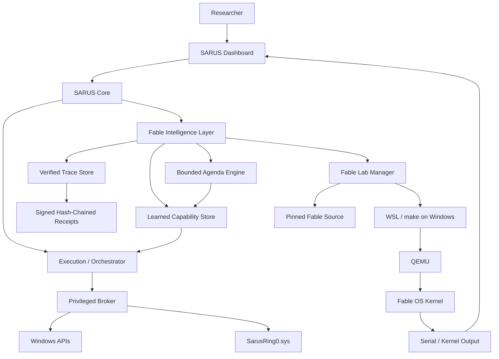
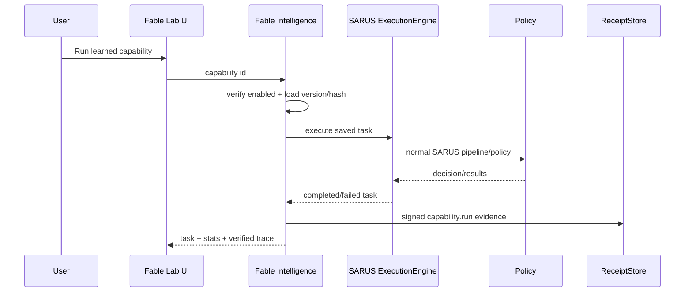
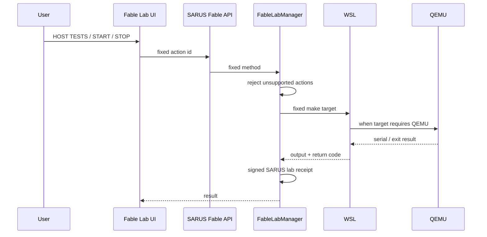

# SARUS Fable Integration

## Status

SARUS integrates the pinned `robiot/fable-os` source as a managed research subsystem and reimplements the Fable ideas that fit a Windows-first production/R&D host as native SARUS services.

This is intentionally **not** a Windows-kernel replacement. Fable remains a separate x86_64 experimental operating system that SARUS can manage as an isolated QEMU lab, while SARUS itself continues to run on Windows with its own broker, receipts, agents, Ollama routing and controlled Ring-0 bridge.

Pinned source:

```text
repo: robiot/fable-os
sha: 1cfe17c4baa77fac128008621721823913a1335c
```

Configured in:

```text
config/online_sources.json
config/sources.json
```

---

## What is integrated

### 1. Original Fable source as a managed lab

SARUS detects the materialized Fable source tree and validates the presence of the important architecture surfaces:

```text
README.md
README.os.md
AGENTS.md
Makefile
core/
tools/
vm/
compiler/
```

The `FableLabManager` exposes only a fixed set of actions:

```text
build
test_host
test_qemu
test_all
iso
clean
start
stop
tail
```

No HTTP caller can supply an arbitrary shell command, make target, QEMU argument, PCI address, device address or API key through this integration.

On Windows the original Fable build/runtime is expected to run through WSL. On POSIX systems SARUS can use native `make`. The SARUS-native Fable intelligence layer remains available even when the optional Fable/QEMU toolchain is not installed.

### 2. Fable-inspired verified execution truth

Fable's strongest architectural concept is the separation between model prose and machine-grounded execution traces.

SARUS implements this using `FableTraceStore` plus the existing signed/hash-chained `ReceiptStore`.

```text
AI explanation
      !=
verified execution proof
```

A trusted SARUS event:

```text
SARUS execution
   -> FableTraceStore.verified(...)
   -> ReceiptStore.create(...)
   -> HMAC-signed/hash-chained receipt
   -> Fable trace row referencing receipt_id
```

Imported Fable serial output is handled differently. A line beginning with `[` at column zero is classified only as a `kernel_candidate`. Imported text is never promoted to a SARUS-verified event merely because it has bracket syntax. This prevents pasted or model-generated text from becoming proof.

Trace kinds:

```text
verified          SARUS-created event with signed receipt
kernel_candidate  imported Fable serial line with Fable trace shape
prose             imported non-trace serial/model text
```

### 3. Persistent learned capabilities

`LearnedCapabilityStore` is the SARUS-native form of Fable persistent capabilities.

A learned capability stores:

```text
id
name
version
description
prompt
permissions
enabled
created / updated
definition_hash
success_count
failure_count
last_status
```

Capabilities are declarative SARUS tasks. They do not persist arbitrary executable kernel code.

Every save creates a new version:

```text
health_check:v1
health_check:v2
health_check:v3
```

The definition is SHA-256 hashed. Execution routes back through the existing SARUS `ExecutionEngine`, so normal planning, policy, adapters, broker decisions and receipts remain in the path.

### 4. Bounded agenda engine

`FableAgendaEngine` brings Fable-style autonomous scheduling into SARUS with explicit bounds.

Supported modes:

```text
boot
once
every
```

Bounds:

```text
max active items:              8
minimum every period:          60 seconds
max total runs:                256
max consecutive failures:      3
execution per scheduler tick:  1
```

Agenda items can invoke only saved SARUS learned capabilities. They do not contain free-form shell commands.

A `boot` or `once` item disables itself after execution. An `every` item stops when its configured max-run count or consecutive-failure limit is reached.

### 5. Native Fable adapter

The old `sarus/adapters/fable_os.py` placeholder has been upgraded.

The adapter now reports:

```text
native: true
runtime: SARUS Fable Intelligence Layer + isolated QEMU/bare-metal research source
```

When Fable participates in a SARUS multi-agent pipeline it receives:

- the current Fable integration/runtime status;
- the best matching original Fable capability/source excerpt;
- previous verified pipeline context when available.

Its system instruction explicitly forbids claiming QEMU, kernel, device or test execution unless execution evidence exists.

### 6. HTTP API

Read endpoints:

```text
GET /api/fable
GET /api/fable/traces
GET /api/fable/capabilities
GET /api/fable/agenda
GET /api/fable/lab/tail
```

Write endpoints:

```text
POST /api/fable/lab
POST /api/fable/capability/save
POST /api/fable/capability/run
POST /api/fable/capability/toggle
POST /api/fable/agenda/add
POST /api/fable/agenda/toggle
```

All POST routes use the same SARUS local session token and same-origin protection as the rest of the dashboard.

### 7. Fable Lab dashboard

Open:

```text
http://127.0.0.1:8877/fable.html
```

The page shows:

- source completeness;
- pinned Fable SHA;
- detected tool source files;
- WSL/make/QEMU readiness;
- running state and PID;
- fixed build/test/start/stop actions;
- serial output classification;
- learned capability creation/versioning/execution;
- agenda creation and state;
- verified trace/evidence feed.

---

## Architecture



---

## Request flow: learned capability



---

## Request flow: original Fable lab



---

## Windows runtime setup for the optional original Fable lab

The main SARUS/Fable integration does not require Fable to boot. To actually build or boot the original Fable kernel from a Windows SARUS machine, the lab requires a Linux build environment. SARUS detects WSL and uses it when present.

At minimum the WSL environment needs the toolchain expected by the upstream Fable Makefile, including `make`, `nasm`, the x86_64 ELF cross compiler/binutils, and QEMU for boot tests/runs.

SARUS does not silently install or weaken Windows security controls to obtain these tools.

Check readiness in the dashboard or:

```text
GET http://127.0.0.1:8877/api/fable
```

Relevant fields:

```text
source.source_complete
source.wsl_available
source.native_make
source.native_qemu
source.runtime_ready
source.running
```

---

## Security and trust boundaries

The integration deliberately does not copy several risky Fable implementation choices into the Windows host architecture.

Not ported into SARUS host control:

- RWX-everywhere host memory architecture;
- generic arbitrary kernel memory read/write;
- unsandboxed DMA control surface;
- caller-supplied raw QEMU/device arguments;
- caller-supplied raw make/shell commands;
- autonomous live arbitrary Windows kernel patching.

Original Fable experiments stay in their own QEMU research boundary when the lab is used.

SARUS Windows privileged actions continue to pass through the existing Privileged Broker and controlled Ring-0 bridge.

---

## Tests

Integration test file:

```text
tests/fable_integration_test.py
```

The test suite validates:

1. source completeness and pinned SHA handling;
2. verified trace -> signed receipt linkage;
3. imported bracketed serial text does not become verified proof;
4. learned capability versioning and SHA-256 definition hashes;
5. learned capability execution through the SARUS execution engine;
6. success/failure statistics;
7. one-shot agenda execution and auto-disable;
8. minimum period and active-item bounds;
9. rejection of free-form lab actions;
10. actual repository Fable source materialization;
11. real source probe without requiring QEMU to be installed.

CI workflow:

```text
.github/workflows/fable-integration.yml
```

It runs on Ubuntu and Windows with Python 3.11. The Linux job also runs the existing SARUS integration regression suite.

The CI integration proof is separate from a physical Fable/QEMU run. `runtime_ready=false` means the host is missing WSL/make/toolchain setup; it does not mean the SARUS-native Fable layer failed to integrate.

---

## Files added/changed

```text
sarus/core/fable.py
sarus/core/app.py
sarus/adapters/fable_os.py
sarus/server.py
sarus/web/fable.html
tests/fable_integration_test.py
.github/workflows/fable-integration.yml
docs/FABLE-INTEGRATION.md
```

The normal SARUS one-click installer recursively packages the repository payload, so these files and the already configured Fable source are part of the installed SARUS tree when the Windows installer is built from this revision.

---

## Licensing note

The pinned upstream Fable source should be treated as research/reference material unless redistribution rights are confirmed for the exact upstream snapshot. SARUS-native integration code in `sarus/core/fable.py` is a clean architectural implementation and does not copy Fable kernel source into the SARUS core module.
