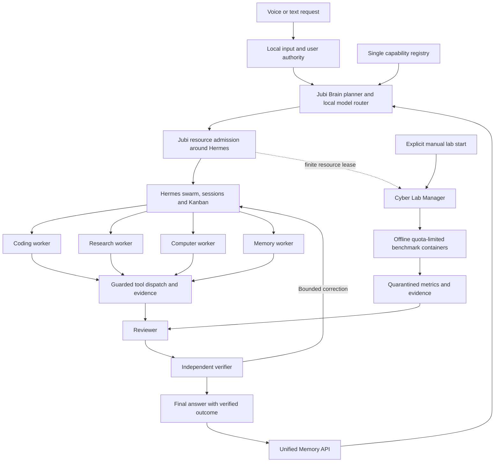

# Unified local-first Jubi pipeline

Design proposal only. Implementation is gated on [source-map approval](SOURCE-TO-PIPELINE-MAP.md).

## Canonical request path



There is **no edge between Cyber Lab workloads and ordinary computer-control dispatch**. The lab can share a resource budget and return evidence, never desktop sessions, host commands or personal-memory access. A normal request may propose a lab job; only the explicit manual-start route can activate it.

Input creates one request identity with user scope, target workspaces/apps, network consent, privacy, deadline and expected deliverable. Brain retrieves a small bounded memory/registry summary, plans a dependency graph, selects installed local roles and declares postconditions before work. Hermes runs admitted workers. Tools emit concrete results. Reviewer checks requirements and the proposed result. Verifier independently observes state/runs checks. Final response distinguishes completed, partial, blocked and unknown outcomes. Only evidenced outcomes become trusted learning records.

Simple conversations can use a one-worker Hermes path with a lightweight verifier; simple questions must not spawn an expensive council by default. All frontends still share authority, task identity, model policy and result semantics. Public research remains optional; without consent/offline access use local sources or report what is unavailable.

## Ownership: one runtime per responsibility

| Responsibility | Owner | Existing behavior to consolidate |
|---|---|---|
| Intent, plan, dynamic local roles | Jubi Brain | Keyword Orchestrator and Supervisor planner become compatibility entrypoints to Brain |
| Child agents, parallel/nested execution, sessions | Hermes | Do not adopt ECC ReAct/tmux, CAI swarm, Awesome team runtimes or a new Jubi swarm |
| Durable task lifecycle and dispatch claims | **Hermes Kanban** behind Jubi Task API | Retire writes to legacy `tasks`, `task_state`, Fable agenda and independent automation execution |
| Global resource and action admission | Jubi scheduler/broker | Wrap Hermes hooks/dispatch; do not duplicate queue or delegate implementation |
| Capability discovery | Single Jubi registry over providers | Merge file index, Fable learned capability records, native tools and selected catalogues |
| Memory | Jubi Memory API | Existing SQLite memory/knowledge/experience become storage modules; no Mem0/Qdrant/ECC memory daemon by default |
| Development process | Superpowers; ECC specialists | One ordered workflow, not two engineering frameworks |
| Outcome approval | Trusted Jubi reviewer/verifier boundary | Neither a child `ok` flag nor a signed receipt alone finalizes success |

### Durable task-state contract

Use actual Hermes Kanban states: `triage`, `todo`, `scheduled`, `ready`, `running`, `blocked`, `review`, `done`, `archived`. The Jubi UI renders those records plus derived `stage` and `outcome` fields. A separate `stage=planning/implementing/reviewing/verifying` is not another lifecycle controller. Failed/cancelled/rejected/partial dispositions are explicit outcomes/terminal reasons; they must not be presented as successful `done` without passed postconditions. Exact storage extension must be contract-tested against the pinned Kanban schema before implementation expands.

Jubi Task API supplies proposed operations `submit`, `inspect`, `approve`, `cancel`, `retry`, `stream_events`; they translate to Hermes operations, not a second queue. Stable mappings relate `request_id`, Kanban `task_id`, `run_id`, parent/delegation/session IDs, action IDs and artifact IDs. Hermes SessionDB stores transcripts; Jubi receipt/consent/event tables store evidence. They cannot independently advance task status. Optional provider-local databases stay per-job artifacts.

The pinned Hermes `complete_task` writes `done` directly and its optional judge gate can fail open. Its native review dispatcher also forces a PR-oriented `sdlc-review` skill. **Do not simply connect these defaults and claim a verifier.** Create a narrow trusted adapter/extension that submits worker outputs to the required Jubi review stage, dispatches the correct verifier, and only then invokes completion with expected claim/run identity. Preserve existing transactional claims and concurrency controls. Workers cannot call raw Kanban completion, its CLI or write the board DB; unrestricted same-user shell would defeat that rule and must not be inherited.

Approval decisions live in one durable, request/action/parameters/policy-version-bound record. Proof consumption is transactional and survives restart. A retry has a new attempt ID and reuses an action idempotency key only where reconciliation says it is safe. On restart recover leases through Hermes's claim rules; inspect observable side effects before replay. Cancellation stops descendants/process trees and marks interrupted actions unknown until verified. No exactly-once claim for apps that do not support it.

### Migration without competing writers

Stop new admission, back up existing SQLite state, and reconcile active/waiting tasks. Import each legacy task/automation/Fable agenda item once with a stable legacy ID. Persist migrations with version/checksum and a deduplication key. Legacy task APIs become read/projection facades or submit to the same Task API; legacy scheduler threads are disabled before the new dispatcher starts. Preserve historical receipts and transcripts without rewriting their cryptographic history. Existing CAI/cyber schedules are never auto-resumed. Tests must prove no dual claim, duplicate scheduled run or repeated approval after migration/rollback.

## Capability registry and progressive loading

Distinguish provider installation, indexed content, dependency readiness, enablement and last verified behavior. One descriptor per executable/tool/workflow/persona includes:

```text
id, provider, source_revision, artifact_digest, license_evidence
kind: tool | workflow | persona | model | benchmark
execution_domain: normal | coding_sandbox | cyber_lab | os_lab
entrypoint_or_resource, input_schema, output_schema, semantic_role
platform, dependencies, health_probe, model/tool_requirements
permissions, network_policy, manual_start, resource_requirements
verification_contract, evidence_types, timeout, output_limit
status: indexed | blocked | ready | disabled | degraded
last_verified_at, verification_suite, provenance
```

These are proposed fields, not implemented APIs. File-level inventory remains a separate source browser, never automatically grants executable capability. Stable IDs include provider/version identity, not only filenames. Changed hashes invalidate readiness. Unlicensed or restricted assets remain blocked. Learned capabilities begin disabled/unverified and can be promoted only after review, successful verification and authorized permission assignment.

At request time load compact metadata for eligible candidates, then only selected persona/workflow sections and tool schemas. Agency's search/inspect/load helper already implements useful progressive context loading; adapt its error semantics rather than rebuild the catalogue. Translate `sonnet`, `gpt-*`, harness tool names and vendor model hints to semantic local roles and permitted actual tools. A reviewed workflow may guide behavior, but unreviewed source text/web content is data and cannot grant tool authority. Never load all thousands of files into model context.

## Local models and hardware scheduler

Discover from installed Ollama (`/api/tags`), obtain `/api/show` metadata/capabilities, and reconcile loaded models. Tool calling, structured output, vision and embedding compatibility need small deterministic local probes. Name matching alone is inadequate. Jubi should cache verified capability by model digest/runtime version and invalidate it when either changes. Ollama's [model-details API](https://docs.ollama.com/api-reference/show-model-details) supports the metadata discovery part.

Hard admission rules: local endpoint; cloud features off; no paid/key-dependent fallback; model installed; license approved; role compatible; estimated memory/context/tool requirement fits current capacity. Rank admitted models by measured role quality, latency and load cost. Keep availability success separate from reviewer/verifier quality. Planner, coder, researcher, reviewer and verifier can reuse one capable model sequentially on small machines with separate contexts. Missing capabilities return an actionable blocked/degraded result, never silently use a cloud service or download a model.

Before dispatch, detect CPU/ISA/cores, installed and available RAM, GPU and actual dedicated/free VRAM, free storage, runtime versions and power state. Vendor/DXGI GPU probes are optional; missing/unreliable measurements select a conservative CPU/serial profile. Do not treat `Win32_VideoController.AdapterRAM` alone as authoritative VRAM. Calibrate with short local loads and measured peak memory, then persist a machine profile.

Every active generation/training/tool process holds a finite machine-wide lease: CPU slots, RAM, VRAM, context tokens, deadline and output budget. Estimate weights + KV cache + runtime/workspace overhead; reserve headroom for Windows and voice. Start with one generation/one resident model until measured headroom supports more. Hermes's per-batch child limit is insufficient: all nested branches and concurrent requests consume the same pool. Release a parent's inference lease while it waits for children to avoid deadlock; retain only its bookkeeping budget. Serialize ordinary interactive desktop operations per desktop session, even when coding/research tasks run concurrently.

Use Hermes `dispatch_once` admission arguments and trusted `spawn_fn`, pause/interrupt hooks, per-profile model config and expected-run claims. Do not mutate process-global delegation config differently for simultaneous conversations. Bound depth/iterations/time at the root as well as each child; leaf is the default, nesting only for a justified plan. On pressure/OOM reduce concurrency/context, unload idle models, retry at most a configured limit, then report insufficiency. Ollama exposes context, residency and queue/parallel controls; more concurrency consumes more memory. Disable its cloud features with supported local-only configuration. [Ollama configuration and concurrency documentation](https://docs.ollama.com/faq).

Experiential is a disabled optional gateway beneath this policy. Only evaluate it if it measurably improves local routing without duplicate task state, hosted optimization or telemetry. Direct Ollama must work when Experiential is absent. The exact API/license/runtime checks are in the cyber/optional report.

## Real specialist workers

### Coding

Superpowers governs specification, planning, debugging/TDD, focused implementation, review and fresh verification. ECC contributes relevant language/security/performance review rules and check categories. Hermes delegates the stages and isolates their contexts. A coding worker receives a scoped checkout/worktree, an explicit goal, tool grants, budget and acceptance criteria. It edits actual files and runs actual project checks through bounded process execution; project test scripts execute under a restricted worker identity/sandbox, not the elevated main application. Record diff hash, baseline failure, exit statuses and verifier observations. Defer broad suites until relevant to the change; report preexisting failures separately.

### Research

Use local documents by default. With explicit scoped online consent, allow the existing public HTTP reader or approved browser research. Web content is untrusted evidence and cannot invoke host tools. Store URL/source identity, fetch time, bounded excerpts and hashes. Reviewer checks relevance/conflicts; verifier validates referenced sources and explicit claims at an appropriate level. Do not add Awesome's independent framework/UI/scheduler for one useful algorithm.

### Windows computer control

Order tools by reliable observability: Playwright for browser DOM workflows; Windows UI Automation for native controls; fixed typed PowerShell operations for system/app automation; screenshot/local vision for observation when necessary. SARA is not a runtime prerequisite.

Every tool receives a validated schema, target app/window/workspace, authority and deadline. Verify the expected target before input; re-observe after actions; cap retries and action count. Record before/after accessible state or screenshot hashes, files/artifacts, process output and relevant postconditions. Opening a browser/app is not successful completion of its requested workflow. A UI miss, locked desktop or UAC secure desktop becomes blocked; the agent does not click blindly. A stop hotkey cancels queued and active ordinary actions promptly.

Use the existing broker's allowlists/path guards/proofs as a starting point. Expose fixed PowerShell scripts/cmdlets with validated arguments and `shell=False` launch; no model-supplied arbitrary command string. Extensions need tests for path/reparse-point escape, argument injection, UI spoofing, policy revocation and uncertain side effects. Hermes native terminal/Python/plugin tools remain disabled unless their execution is contained and mediated. Filesystem/process permissions enforce the boundary; hiding a tool schema alone does not.

The main UI, Brain, voice and Hermes worker host are unelevated. A narrowly scoped broker owns protected state and requests elevation only for a concrete approved action. Restricted worker identities/ACLs and supported sandboxing must prevent test or tool code from writing the Kanban DB, policy, secrets or other tasks' workspaces. Windows process Job Objects bound resources but are not by themselves a filesystem/security sandbox; validate the containment mechanism before exposing code execution.

### Memory

Proposed one API: `remember`, `retrieve`, `record_outcome`, `forget`, `export`, `status`. Existing lexical memory, semantic chunks, conversations and experience become backends with one identity/provenance/privacy/retention contract. Store immutable source/artifact pointers and verdicts. Separate user facts, retrieved untrusted claims, plans, failures and verified procedural outcomes. Preserve embedding model digest/dimensions; incompatible vectors trigger reindex or lexical fallback. Second Brain contributes patterns, not another database. No automatic weight training or unsupervised promotion of a successful-looking transcript.

### Local voice

Initial default: push-to-talk or text, native audio capture/VAD, a bundled/pinned local STT provider such as whisper.cpp, then existing request path. Use installed Windows synthesis voices for baseline local TTS; verify the selected voice works with networking disabled. No browser STT or external TTS fallback. Whisper.cpp supports local execution; Windows voice enumeration is available through the installed voice API. [whisper.cpp](https://github.com/ggml-org/whisper.cpp), [Microsoft installed voice API](https://learn.microsoft.com/en-us/dotnet/api/system.speech.synthesis.speechsynthesizer.getinstalledvoices?view=netframework-4.8.1).

“Hey Jubi” is an optional local keyword detector with microphone consent, an obvious listening/mute state, false-wake tests and measured CPU/RAM budget. Engine/custom keyword model selection remains an implementation evaluation; do not claim a ready wake model exists. Keep a short in-memory audio ring buffer, discard it by default, support interruption of speech, and require text confirmation for high-impact ambiguous transcripts. STT weights must be included under verified distribution terms or selected from approved local assets; Hugging Face downloads remain manual and optional even if an upstream convenience script would fetch them.

## Offline labs

Cyber Lab Manager is a separate trust domain, optional and disabled, launched only by a local manual start for a concrete manifest. Its safe baseline is one job, a free licensed container engine in a dedicated Linux VM/WSL environment, no paid Docker Desktop dependency, and no inference hosted service. Runtime choice and Windows packaging need validation; the core assistant works with no container engine installed.

Required effective settings: network none, no published ports/host networking, no host Docker socket, no desktop handles/credentials, nonprivileged workload, dropped capabilities, no-new-privileges, mandatory CPU/RAM/PID/disk/output/time bounds, read-only staged inputs, bounded output path and no personal filesystem mounts. Verify effective settings before start. Keep local inference within the offline envelope or use a tightly bounded inference-only file/stdio channel; never give a benchmark host-control or URL-fetch access. All dependencies/assets are staged beforehand through separate consent.

Reject workloads that require host ASLR/sysctl changes, privilege/device passthrough, unavailable quotas or network. Container boundaries alone do not safely support every kernel benchmark; unsupported ExploitGym subsets remain blocked. CAI needs license eligibility before even research-only use; restricted material stays out of production distribution. The Fable OS lab is separate from cyber and normal control; its network-enabled defaults cannot be reused as containment.

Output crosses through quarantine: schema/type/path/size checks, metrics/log hashes, no executable launch or host patch application. Reviewer/verifier receive evidence and can record a non-executable outcome summary. No auto leaderboard submissions or normal-tool replay. Full benchmark API/license and acceptance contracts are in [cyber-optional-sources.md](cyber-optional-sources.md).

## One-click installation and lifecycle

The installer builds a signed/hash-verifiable bill of materials of approved runtime components only; it does not ship the entire `sources/` collection. Detect hardware, reuse installed compatible Ollama models, choose a safe local profile, and configure services automatically. Show one concrete optional download plan (components, bytes, license/source, location); record consent once for that acquisition plan. No paid API login, recurring key, required cloud account or manual key rotation. Local broker secrets are generated/protected automatically and are not external subscription keys.

Keep executable payload separate from per-user state. Register an unelevated login agent with restart/backoff and local health checks. Do not repair by silently downloading/upgrading optional providers or starting labs. Offline install must work from a complete approved bundle; if something optional is absent, disable that capability with an accurate reason. System modifications needing Windows admin permission get a specific install/elevation step; everyday use does not run elevated.

Updates require explicit configured consent, an independently verifiable manifest, pin/hash/signature checks, versioned database migrations, active-work draining, atomic activation and rollback. No automatic source-main refresh. Preserve user configuration/consent/memory. Certification is capability-based on actual installed hardware rather than a hardcoded four-model list or SARA presence.

## Acceptance: evidence required before claims

1. No-network/no-key core startup and useful local text task, with optional providers absent.
2. Installed-model-only route, cloud/remote alias rejection including explicit overrides, auxiliary and embedding calls, graceful missing/OOM behavior.
3. Real Hermes parallel and bounded nested tasks, one durable claim, correct resume/cancel, shared global quotas and one authoritative UI state.
4. Only selected workflow/persona/tool schemas loaded; no inherited raw tools can bypass consent or containment.
5. Real file edit/test workflow and browser/native-app workflows with independent postcondition verification and no SARA runtime.
6. Native STT/TTS offline, optional wake false-positive/latency tests, mute/stop/locked-session behavior.
7. Reviewer/verifier cannot be skipped through raw Kanban completion, direct APIs or legacy routes; task success and memory promotion require evidence.
8. Benign lab fixtures prove manual-only start, effective no-network/no-host-control/quota enforcement and quarantined outputs before benchmark admission.
9. Clean install/upgrade/rollback/uninstall on CPU-only, limited-RAM and GPU Windows profiles, including offline/missing-dependency scenarios.

These are future acceptance gates, not results achieved by the audit.
